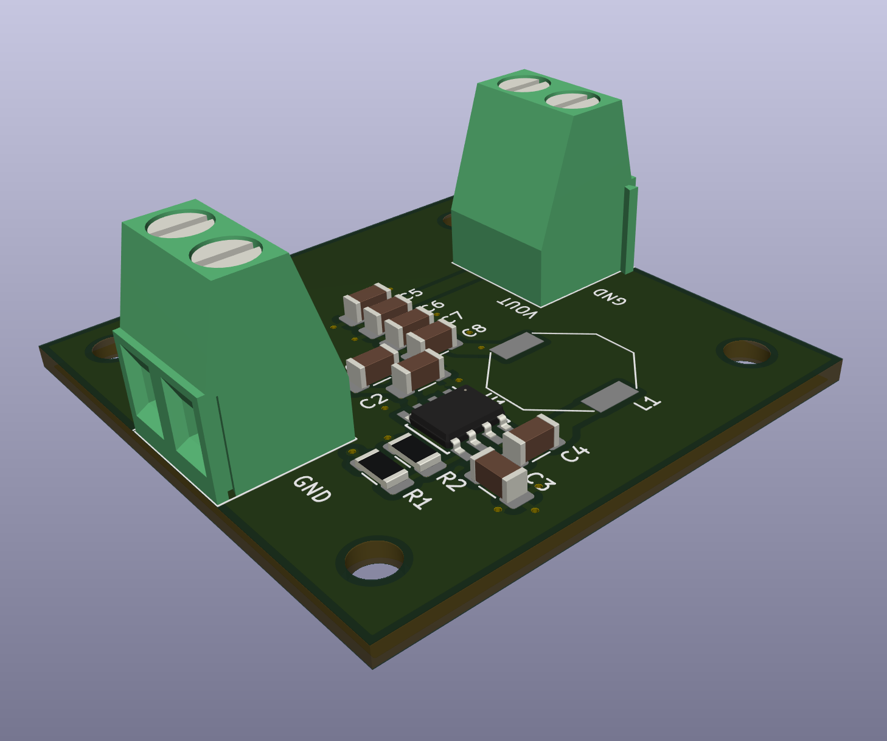

# Voltage_regulators
Collection of switching voltage regulators

## BUCK LMR33630

[BUCK LMR33630](https://www.ti.com/lit/ds/symlink/lmr33630.pdf)

* Input voltage range: 3.8V to 36V
* Output voltage: Configured at 3.3V
* Output current: Up to 3A

[schematic](BUCK_LMR33630/documentation/BUCK_LMR33630.pdf)

## BUCK LM2576

* ONLY Schematics
* Replaced by LMR33630 

